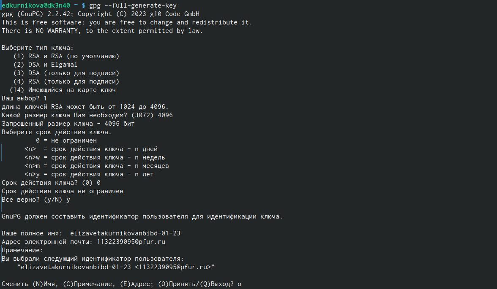
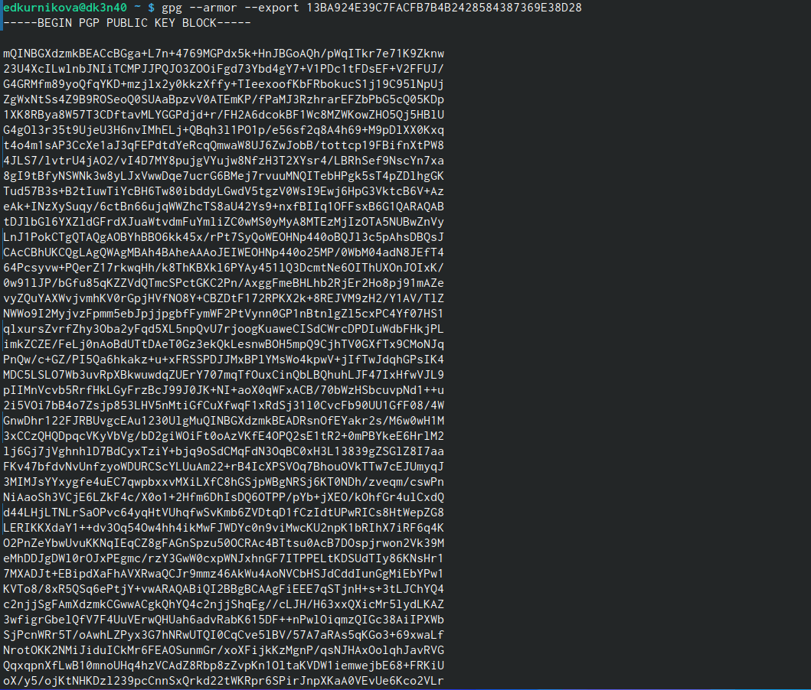
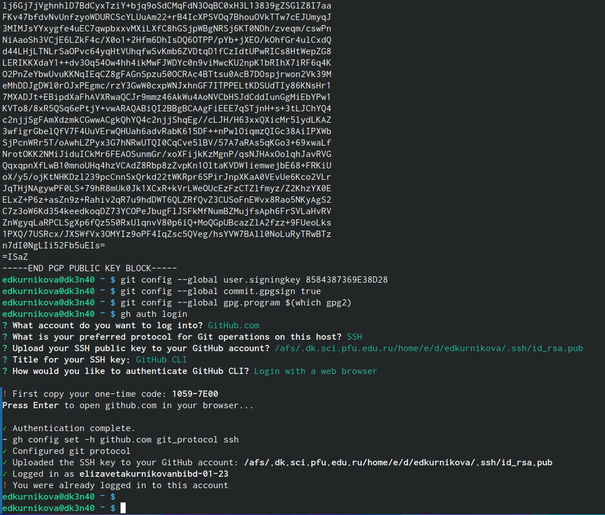
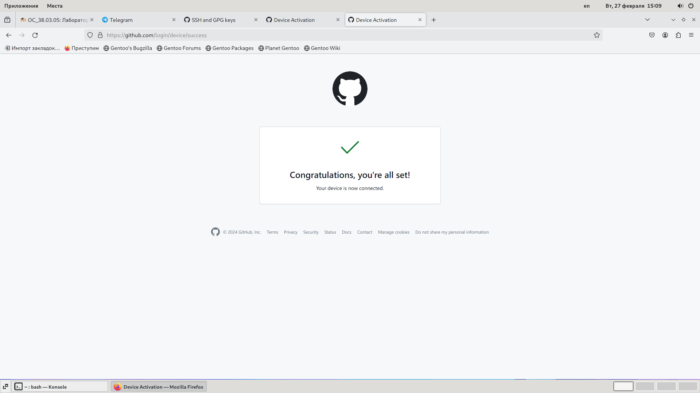
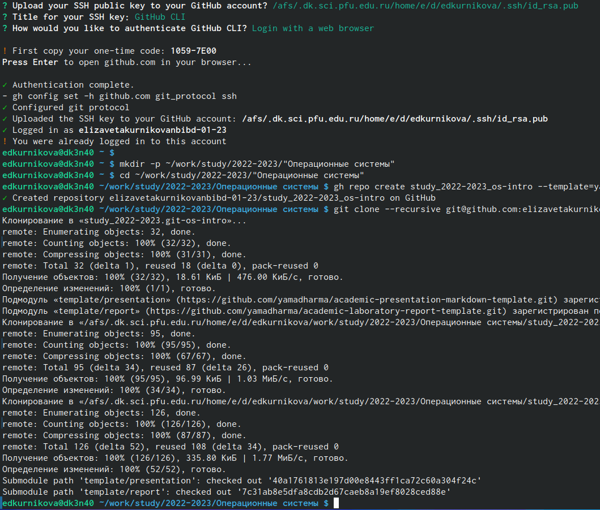
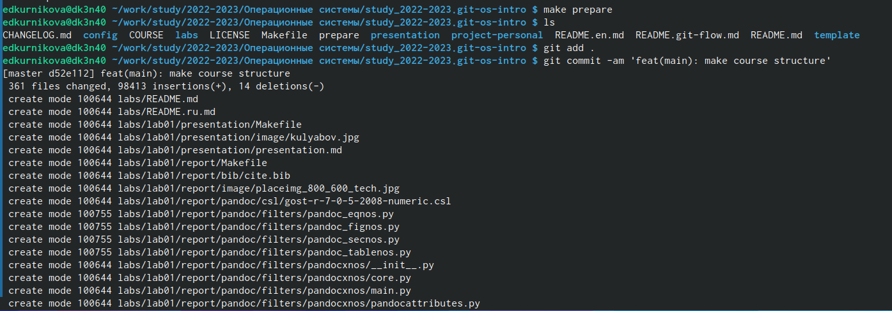

---
## Front matter
title: "Отчёт по лабораторной работе №2"
subtitle: "дисциплина: Операционные системы"
author: "Курникова Елизавета"

## Generic otions
lang: ru-RU
toc-title: "Содержание"

## Bibliography
bibliography: bib/cite.bib
csl: pandoc/csl/gost-r-7-0-5-2008-numeric.csl

## Pdf output format
toc: true # Table of contents
toc-depth: 2
lof: true # List of figures
lot: true # List of tables
fontsize: 12pt
linestretch: 1.5
papersize: a4
documentclass: scrreprt
## I18n polyglossia
polyglossia-lang:
  name: russian
  options:
	- spelling=modern
	- babelshorthands=true
polyglossia-otherlangs:
  name: english
## I18n babel
babel-lang: russian
babel-otherlangs: english
## Fonts
mainfont: PT Serif
romanfont: PT Serif
sansfont: PT Sans
monofont: PT Mono
mainfontoptions: Ligatures=TeX
romanfontoptions: Ligatures=TeX
sansfontoptions: Ligatures=TeX,Scale=MatchLowercase
monofontoptions: Scale=MatchLowercase,Scale=0.9
## Biblatex
biblatex: true
biblio-style: "gost-numeric"
biblatexoptions:
  - parentracker=true
  - backend=biber
  - hyperref=auto
  - language=auto
  - autolang=other*
  - citestyle=gost-numeric
## Pandoc-crossref LaTeX customization
figureTitle: "Рис."
tableTitle: "Таблица"
listingTitle: "Листинг"
lofTitle: "Список иллюстраций"
lotTitle: "Список таблиц"
lolTitle: "Листинги"
## Misc options
indent: true
header-includes:
  - \usepackage{indentfirst}
  - \usepackage{float} # keep figures where there are in the text
  - \floatplacement{figure}{H} # keep figures where there are in the text
---

# Цель работы

1. Изучить идеологию и применение средств контроля версий.
2. Освоить умения по работе с git.

# Задание

1. Создать базовую конфигурацию для работы с git.
2. Создать ключ SSH.
3. Создать ключ PGP.
4. Настроить подписи git.
5. Зарегистрироваться на Github.
6. Создать локальный каталог для выполнения заданий по предмету.

# Теоретическое введение

Системы контроля версий (Version Control System, VCS) применяются при работе нескольких человек над одним проектом. Обычно основное дерево проекта хранится в локальном или удалённом репозитории, к которому настроен доступ для участников проекта. При внесении изменений в содержание проекта система контроля версий позволяет их фиксировать, совмещать изменения, произведённые разными участниками проекта, производить откат к любой более ранней версии проекта, если это требуется.

В классических системах контроля версий используется централизованная модель, предполагающая наличие единого репозитория для хранения файлов. Выполнение большинства функций по управлению версиями осуществляется специальным сервером. Участник проекта (пользователь) перед началом работы посредством определённых команд получает нужную ему версию файлов. После внесения изменений, пользователь размещает новую версию в хранилище. При этом предыдущие версии не удаляются из центрального хранилища и к ним можно вернуться в любой момент. Сервер может сохранять не полную версию изменённых файлов, а производить так называемую дельта-компрессию — сохранять только изменения между последовательными версиями, что позволяет уменьшить объём хранимых данных.

Системы контроля версий поддерживают возможность отслеживания и разрешения конфликтов, которые могут возникнуть при работе нескольких человек над одним файлом. Можно объединить (слить) изменения, сделанные разными участниками (автоматически или вручную), вручную выбрать нужную версию, отменить изменения вовсе или заблокировать файлы для изменения. В зависимости от настроек блокировка не позволяет другим пользователям получить рабочую копию или препятствует изменению рабочей копии файла средствами файловой системы ОС, обеспечивая таким образом, привилегированный доступ только одному пользователю, работающему с файлом.

Системы контроля версий также могут обеспечивать дополнительные, более гибкие функциональные возможности. Например, они могут поддерживать работу с несколькими версиями одного файла, сохраняя общую историю изменений до точки ветвления версий и собственные истории изменений каждой ветви. Кроме того, обычно доступна информация о том, кто из участников, когда и какие изменения вносил. Обычно такого рода информация хранится в журнале изменений, доступ к которому можно ограничить.

В отличие от классических, в распределённых системах контроля версий центральный репозиторий не является обязательным.

Среди классических VCS наиболее известны CVS, Subversion, а среди распределённых — Git, Bazaar, Mercurial. Принципы их работы схожи, отличаются они в основном синтаксисом используемых в работе команд.
# Выполнение лабораторной работы

Базовая настройка git:

1. Задаём имя и email владельца репозитория (1 и 2 строка на рисунке)
2. Настраиваем utf-8 в выводе сообщений git (3 строка на рисунке)
3. Настраиваем верификацию и подписание коммитов git. Зададим имя начальной ветки (будем называть её master) (4 строка на рисунке)

{#fig:001 width=70%}

Создаём ключ SSH. В терминале вводим данную команду:

ssh-keygen -t rsa -b 4096

Далее во всех пунктах пользуемся клавишей Enter и получаем наш ключ.

{ #fig:002 width=70% }

Ключ нужно добавить на github. Для этого переходим на сайте в раздел “Settings” и выбираем “SSH and GPG keys”.

{ #fig:003 width=70% }

{ #fig:004 width=70% }

Выводим список ключей и копируем отпечаток приватного ключа

{ #fig:005 width=70% }

Настройка автоматических подписей коммитов git

{ #fig:006 width=70% }

Возвращаемся в наш терминал и настраиваем gh командой:

gh auth login.

Во всех пунктах выбираем y(yes).

По полученной ссылке переходим в браузер на виртуальной машине и вводим код из терминала (находится перед ссылкой).

#fig:007 width=70% }

Создаём репозиторий курса на основе шаблона. Все нужные команды для создания были в указаниях к лабораторной работе. В 4 команде, вместо <владелец>, указываем своё имя профиля на github.

1. mkdir -p ~/work/study/2021-2022/"Операционные системы" 
2. cd ~/work/study/2021-2022/"Операционные системы" 
3. gh repo create study_2021-2022_os-intro --template=yamadharma/course-directory-student-template --public 
4. git clone --recursive git@github.com:<владелец>/study_2021-2022_os-intro.git os-intro

{ #fig:008 width=70% }

Настраиваем каталог курса. Для этого переходим в него командой:

cd ~/work/study/2021-2022/"Операционные системы"/os-intro

Далее командой ls проверяем, что мы в него перешли. В каталоге “os-intro” нам потребуется удалить файл “package.json”. Выполняем данную задачу командой: 

rm package.json

Снова командой ls проверяем успешное выполнение удаление файла.

{ #fig:009 width=70% }

Создаём необходимые каталоги и отправляем наши файлы на сервер
	
make COURSE=os-intro

1. git add . 
2. git commit -am 'feat(main): make course structure' 
3. git push

{ #fig:010 width=70% }

# Контрольные вопросы

1. Что такое системы контроля версий (VCS) и для решения каких задач они предназначаются? Это программное обеспечение для облегчения работы с изменяющейся информацией. VCS позволяет хранить несколько версий одного и того же документа, при необходимости возвращаться к более ранним версиям, определять, кто и когда сделал то или иное изменение, и многое другое.
2. Объясните следующие понятия VCS и их отношения: хранилище, commit, история, рабочая копия. 
Хранилище (repository), или репозитарий, — место хранения всех версий и служебной информации. 
Commit («[трудовой] вклад», не переводится) — синоним версии; процесс создания новой версии.
История – место, где сохраняются все коммиты, по которым можно посмотреть данные о коммитах.
Рабочая копия – текущее состояние файлов проекта, основанное на версии, загруженной из хранилища.
3. Что представляют собой и чем отличаются централизованные и децентрализованные VCS? Приведите примеры VCS каждого вида.
Централизованные VCS: одно основное хранилище всего проекта и каждый пользователь копирует себе необходимые ему файлы из этого репозитория, изменяет и, затем, добавляет свои изменения обратно. 
Децентрализованные VCS:
у каждого пользователя свой вариант (возможно не один) репозитория.
4. Опишите действия с VCS при единоличной работе с хранилищем. 
5. Опишите порядок работы с общим хранилищем VCS. 
6. Каковы основные задачи, решаемые инструментальным средством git? 
Git — это система управления версиями. У Git две основных задачи: первая — хранить информацию о всех изменениях в вашем коде, начиная с самой первой строчки, а вторая — обеспечение удобства командной работы над кодом.
7. Назовите и дайте краткую характеристику командам git. 
git –version (Проверка версии Git)
git init (Инициализировать ваш текущий рабочий каталог как Git-репозиторий)
git clone https://www.github.com/username/repo-name (Скопировать существующий удаленный Git-репозиторий)
git remote (Просмотреть список текущих удалённых репозиториев Git)
git remote -v (Для более подробного вывода)
git add my_script.py (Можете указать в команде конкретный файл).
git add . (Позволяет охватить все файлы в текущем каталоге, включая файлы, чье имя начинается с точки)
git commit -am "Commit message" (Вы можете сжать все индексированные файлы и отправить коммит).
git branch (Просмотреть список текущих веток можно с помощью команды branch)
git –help (Чтобы узнать больше обо всех доступных параметрах и командах)
git push origin master (Передать локальные коммиты в ветку удаленного репозитория).
8. Приведите примеры использования при работе с локальным и удалённым репозиториями. 
9. Что такое и зачем могут быть нужны ветви (branches)? 
Ветки нужны, чтобы несколько программистов могли вести работу над одним и тем же проектом или даже файлом одновременно, при этом не мешая друг другу. Кроме того, ветки используются для тестирования экспериментальных функций: чтобы не повредить основному проекту, создается новая ветка специально для экспериментов.
10. Как и зачем можно игнорировать некоторые файлы при commit?
Игнорируемые файлы — это, как правило, артефакты сборки и файлы, генерируемые машиной из исходных файлов в вашем репозитории, либо файлы, которые по какой-либо иной причине не должны попадать в коммиты.

# Выводы

В ходе выполнения лабораторной работы изучили идеологию и применение средств контроля версий, а также освоили умения по работе с git.

