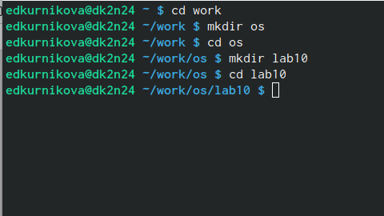
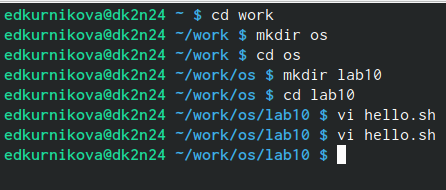
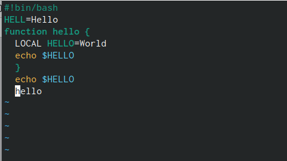
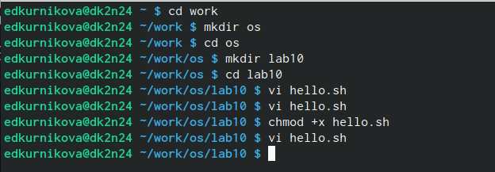
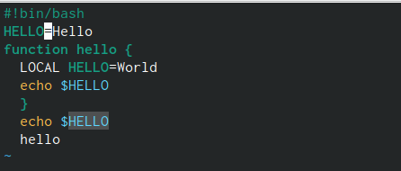
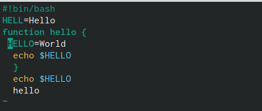
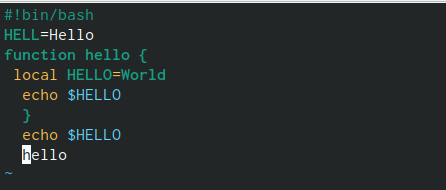
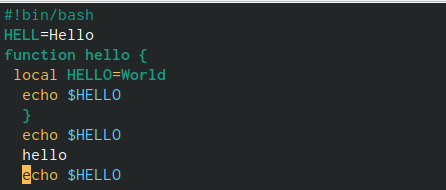
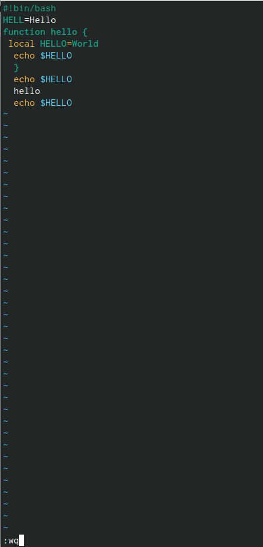

---
## Front matter
lang: ru-RU
title: Лабораторная работа №10
subtitle: "Текстовой редактор vi"
author:
  - Курникова Елизавета
institute:
  - Российский университет дружбы народов, Москва, Россия
  
## i18n babel
babel-lang: russian
babel-otherlangs: english

## Formatting pdf
toc: false
toc-title: Содержание
slide_level: 2
aspectratio: 169
section-titles: true
theme: metropolis
header-includes:
 - \metroset{progressbar=frametitle,sectionpage=progressbar,numbering=fraction}
 - '\makeatletter'
 - '\beamer@ignorenonframefalse'
 - '\makeatother'
---

# Информация

## Докладчик

:::::::::::::: {.columns align=center}
::: {.column width="70%"}

  * Курникова Елизавета
  * студентка НБИбд-01-23
  * Российский университет дружбы народов

:::
::: {.column width="30%"}

:::
::::::::::::::

# Вводная часть

## Объект и предмет исследования

- Редактор vi

# Цель работы

## Цель работы

Познакомиться с операционной системой Linux. Получить практические навыки рабо-
ты с редактором vi, установленным по умолчанию практически во всех дистрибутивах.

# Выполнение лабораторной работы

# Задание 1

## 1

Создайте каталог с именем ~/work/os/lab10.

{#fig:001 width=50%}

## 2

Перейдите во вновь созданный каталог.

{#fig:002 width=50%}

## 3

Вызовите vi и создайте файл hello.sh

{#fig:003 width=50%}

{#fig:004 width=50%}

## 4

Нажмите клавишу i и вводите следующий текст.

{#fig:005 width=50%}

## 5

Нажмите клавишу Esc для перехода в командный режим после завершения ввода
текста.

## 6

Нажмите : для перехода в режим последней строки и внизу вашего экрана появится
приглашение в виде двоеточия

{#fig:006 width=50%}

## 7

Нажмите w (записать) и q (выйти), а затем нажмите клавишу Enter для сохранения
вашего текста и завершения работы.

{#fig:007 width=50%}

## 8

Сделайте файл исполняемым

{#fig:008 width=50%}

# Задание 2. Редактирование существующего файла

## 1

Вызовите vi на редактирование файла

## 2

Установите курсор в конец слова HELL второй строки.

{#fig:009 width=50%}

## 3

Перейдите в режим вставки и замените на HELLO. Нажмите Esc для возврата в команд-
ный режим.

{#fig:010 width=50%}

## 4

Установите курсор на четвертую строку и сотрите слово LOCAL.

{#fig:011 width=50%}
{#fig:012 width=50%}

## 5

Перейдите в режим вставки и наберите следующий текст: local, нажмите Esc для
возврата в командный режим.

{#fig:013 width=50%}

## 6

Установите курсор на последней строке файла. Вставьте после неё строку, содержащую
следующий текст: echo $HELLO.

{#fig:014 width=50%}
{#fig:015 width=50%}

## 7

Нажмите Esc для перехода в командный режим.

{#fig:016 width=50%}

## 8

Удалите последнюю строку.

{#fig:017 width=50%}

## 9

Введите команду отмены изменений u для отмены последней команды.

{#fig:018 width=50%}

## 10

Введите символ : для перехода в режим последней строки. Запишите произведённые
изменения и выйдите из vi.

# Вывод

## Выводы

Мы познакомились с операционной системой Linux. Получили практические
навыки работы с редактором vi, установленным по умолчанию практически во
всех дистрибутивах.

